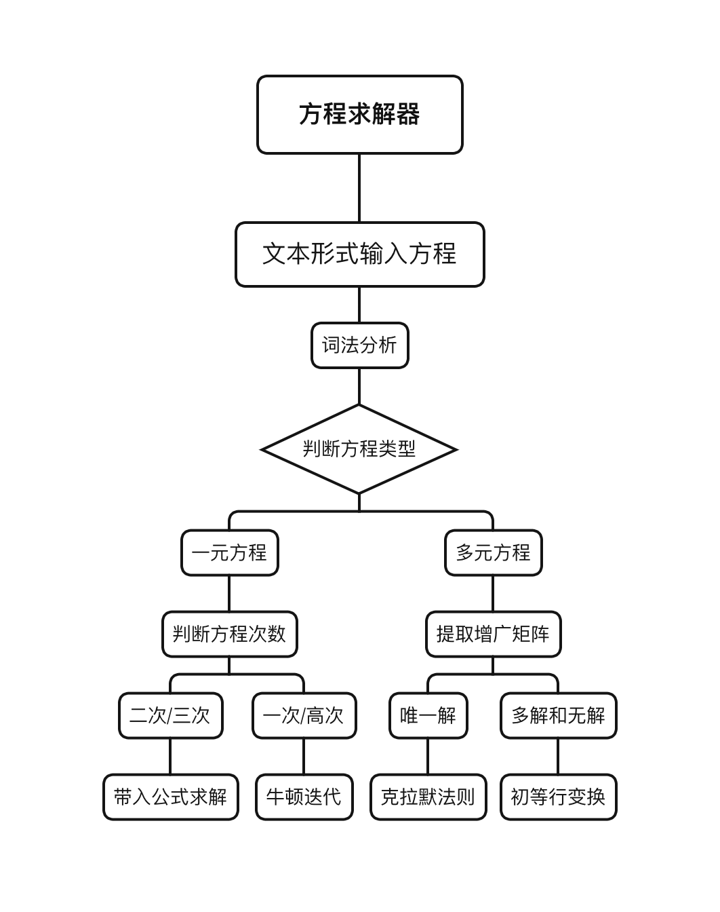

# Lite-Equation-Solver

Enter equations in text form in the console, supporting single-variable polynomial equations and multi-variable linear equations. It supports `+`, `-`, `*`, `/`, `^`  operations, and can perform high-precision solutions. It implements the function of an equation solver, simplifying the cumbersome manual calculation process.

## Pipeline

 
1. The equation text is retrieved and analyzed by a lexical analyzer to construct a ***`binary tree`***, which enables the analysis and processing of the text expression. 
2. Subsequently, the type and solution method of the equation are determined based on the text expression.
    - If it is a ***`single-variable`*** equation, the equation's degree is determined by the analytical result of the equation.
        - If it is a `quadratic` or `cubic` equation, the solution is obtained using the formula method.
        - If it is a `linear` equation or a `higher-degree` equation, the Newton-Raphson iteration method is used to find the approximate root.
    - If it is a ***`multi-variable`*** equation, the augmented matrix is extracted.
        - If the equation has a `unique solution`, Cramer's rule is applied to solve it.
        - If there are `multiple solutions` or `no solution`, elementary row operations are used to find the particular solution.
